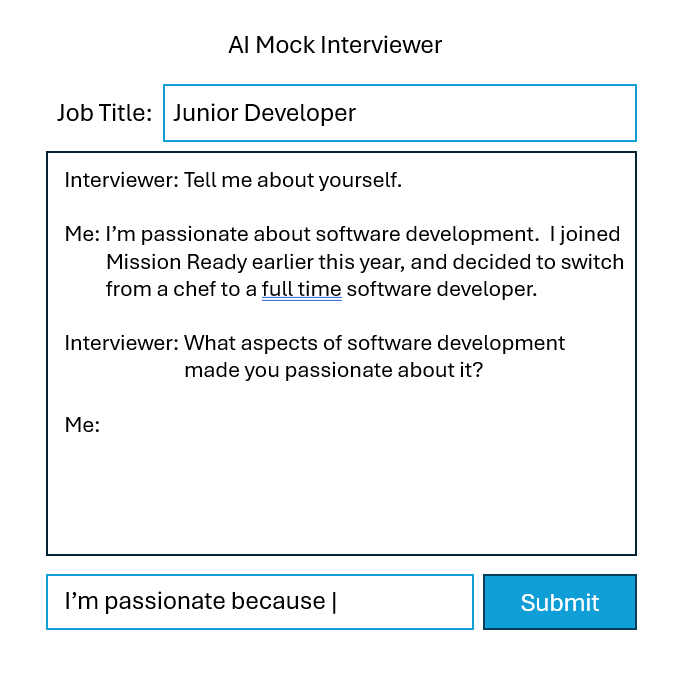

# Mission 3 - Team Assignment

> Check the Mission Page on the Portal for further instructions.

- [Mission 3 - Team Assignment](#mission-3---team-assignment)
	- [Turners Car Insurance](#turners-car-insurance)
		- [The Client](#the-client)
		- [The Project Brief](#the-project-brief)
	- [Development Tasks](#development-tasks)
		- [Build a Mock Job Interview Application using Generative AI](#build-a-mock-job-interview-application-using-generative-ai)

## Turners Car Insurance

### The Client

Turners Car Auctions is a market leader in the automotive industry in New Zealand, responsible for more than 10% of all used vehicle sales in the country. It has retained its original function as a vehicle auctioneer, operating in 19 branches nationwide, but has become increasingly dependent on a parallel role as a conventional used vehicle dealership. In support of that role, it has established in-house finance and vehicle insurance divisions that allow it to offer buyers a complete “one-stop shop” experience.

### The Project Brief

Turners is currently undertaking a major re-design of its motor vehicle insurance systems and processes, including an investigation of ways in which the introduction of new technologies can enhance the buyer experience. Here is some information about motor vehicle insurance at [Turners](https://www.turners.co.nz/Cars/finance-insurance/car-insurance/).  You have just been assigned to the project team to help create a new insurance buying experience.

## Development Tasks

### Build a Mock Job Interview Application using Generative AI

Due to the insurance process redesign, management is expecting a lot of staff in the department to be re-trained into other roles.  Build an application that can be used by a staff member to practice job interviews for another role.  Here is a description of the requirements.

A wireframe is attached below to demonstrate the items required.  You do not need to make it look exactly the same size and colour.  Only the elements need to be there.

The user will see the following items.

- A “Job title” textbox that allow users to type in a job title that they interview for.  It is a free-text field, not a drop down selection.
- A `
` or textarea in the middle that displays both what the user typed and the response of the AI Interviewer as they appear.
- A textbox that allow users to type in response
- A submit button that will submit the response to the application. Upon receiving the response, the application will send the response to generative AI via API to get a response.

For the AI functionality,

- The AI acts as a job interviewer for the job the user specified.  It should ask a series of questions to the user, and can adjust its response based on the answers.
- The flow will start with the Interviewer saying “Tell me about yourself”.  It should ask at least 6 questions based on response of the user.  Other than the first question, the questions should not to be “hardcoded” in the prompt or in the code. You can however mention topic areas to ask questions for (if needed).
- The questions should be to interview for the role typed in by the user.
- At the end of the whole interview, the AI Interviewer should comment on how well the user answered the questions, and suggest how the user can improve its response.
- You will need to use generative AI to build the application.  You are encouraged to use Google Gemini API because it is free of charge. OpenAI GPT-4 is a paid alternative.  You can use it but you will be responsible for the costs incurred if you used any paid service for the Mission.

The following resource may help:

- **RECOMMENDED** Google Gemini API Documentation https://ai.google.dev/gemini-api/docs (1 hour)
- **RECOMMENDED**  Prompting Strategies https://ai.google.dev/gemini-api/docs/prompting-strategies  (1 hour)
